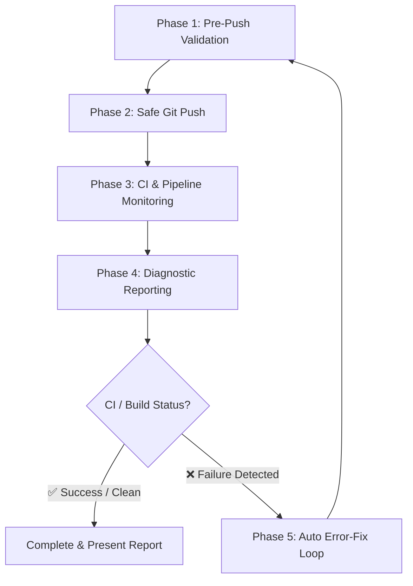

# Git Push, CI Log Monitoring & Error-Fix Workflow

This skill guides the agent through a robust 5-phase workflow for safely pushing code, monitoring remote CI/CD pipelines and local runtime logs, reporting execution status, and autonomously diagnosing and fixing errors when failures occur.

---

## Workflow Overview



---

## Step-by-Step Procedure

### Phase 1: Pre-Push Validation
Before pushing any code to remote, execute the pre-push safety and validation script:

1. Run the pre-push check:
   ```bash
   python3 .agents/skills/git-push-workflow/scripts/pre_push_check.py
   ```
2. Verify that:
   - No sensitive files (`.env`, `certs/*.key`, `*.pem`, secrets) are staged or in unpushed commits.
   - Python code across all services compiles without AST / syntax errors.
   - Branch status is clean or uncommitted changes are intentionally managed.
   - Local branch is up-to-date with remote (if behind, run `git pull --rebase origin <branch>`).

---

### Phase 2: Safe Git Push
Execute the safe push script to push the current branch to the remote repository:

1. Run the push helper:
   ```bash
   bash .agents/skills/git-push-workflow/scripts/git_push.sh
   ```
2. Verify that the command succeeds with exit code `0`. If rejected (e.g. non-fast-forward), refer to [Troubleshooting Reference](./references/troubleshooting.md).

---

### Phase 3: CI & Pipeline Log Monitoring
After pushing, monitor remote GitHub Actions workflows and local container health:

1. Run the pipeline monitor:
   ```bash
   python3 .agents/skills/git-push-workflow/scripts/monitor_pipeline.py --timeout=120 --poll-interval=5
   ```
2. The monitor will:
   - Query GitHub Actions API for workflows triggered by the latest commit SHA / branch.
   - Poll until workflow runs conclude or timeout is reached.
   - Check local Docker container health (`docker compose ps`).
   - Extract failing steps, error logs, and stack traces if a failure occurs.

---

### Phase 4: Diagnostic Report Generation
Present a structured report summarizing the push and pipeline state:

1. Include the following sections in the final output:
   - **Metadata Table**: Repository, Branch, Commit SHA, Pipeline Status.
   - **Workflow Breakdown**: Workflow name, event, status, conclusion, and direct links.
   - **Local Container Health**: Service names, status, port mappings.
   - **Failure Analysis** (if applicable): Offending file, error message, root cause explanation.

---

### Phase 5: Automated Error-Fix Loop (If Failures Detected)
If the pipeline monitor exits with code `1` (or logs show errors):

1. **Diagnose**: Analyze the failing job/step logs output by `monitor_pipeline.py`.
2. **Isolate Root Cause**: Check the affected source files in `services/`.
3. **Apply Fix**: Make necessary code modifications using file editing tools.
4. **Local Verification**: Run pre-push checks locally to confirm the fix:
   ```bash
   python3 .agents/skills/git-push-workflow/scripts/pre_push_check.py
   ```
5. **Commit Fix**:
   ```bash
   git add <modified_files>
   git commit -m "fix(<scope>): resolve pipeline error in <component>"
   ```
6. **Re-run Workflow**: Re-start from **Phase 1** until the pipeline completes cleanly.

---

## Helper Scripts Reference

- [pre_push_check.py](./scripts/pre_push_check.py): AST syntax validation, secret check, branch divergence.
- [git_push.sh](./scripts/git_push.sh): Safe git push with upstream tracking configuration.
- [monitor_pipeline.py](./scripts/monitor_pipeline.py): GitHub Actions and Docker container log monitor.
- [local_lint_check.sh](./scripts/local_lint_check.sh): Project-wide linting and quality checks.
- [troubleshooting.md](./references/troubleshooting.md): Playbook for resolving push rejections, CI failures, and container crashes.
