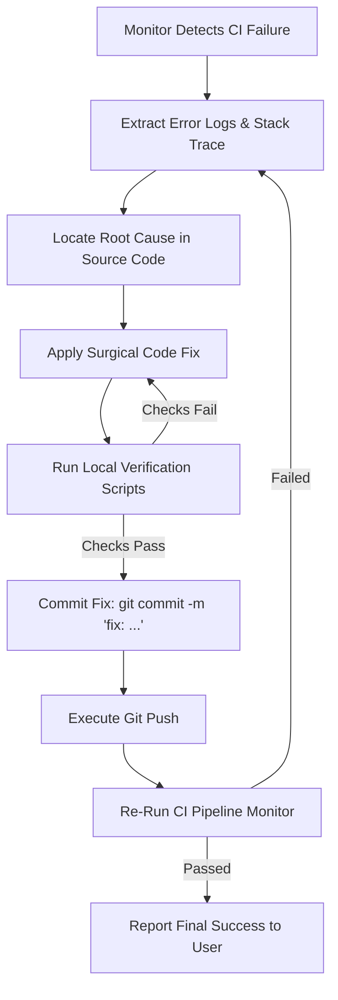

# Git Push & CI Pipeline Troubleshooting Guide

This guide provides diagnostics and remediation playbooks for common failure modes encountered during `git push`, CI/CD workflow execution, and post-deployment health checks.

---

## 1. Git Push Failure Modes

### 1.1 `[rejected - non-fast-forward]` (Remote Contains Commits Local Doesn't Have)
- **Symptom**: `git push origin <branch>` fails because remote has new commits.
- **Remediation**:
  1. Fetch remote changes without merging: `git fetch origin <branch>`
  2. Rebase local commits cleanly on top of remote: `git pull --rebase origin <branch>`
  3. If merge conflicts arise:
     - Check conflicting files: `git status`
     - Resolve conflicts preserving intentional changes.
     - Mark resolved: `git add <resolved_file>`
     - Continue rebase: `git rebase --continue`
  4. Re-run pre-push checks and push: `git push origin <branch>`

### 1.2 `[remote rejected] (protected branch hook declined)`
- **Symptom**: Direct push to `main` or `develop` is blocked by branch protection rules.
- **Remediation**:
  1. Create a feature branch: `git checkout -b fix/<feature-description>`
  2. Push the feature branch: `git push -u origin fix/<feature-description>`
  3. Create a Pull Request (PR) on GitHub.

### 1.3 `Authentication / Permission Denied (publickey)`
- **Symptom**: SSH key is missing or not authorized for the remote repository.
- **Remediation**:
  1. Test SSH connectivity: `ssh -T git@github.com`
  2. Verify SSH agent: `ssh-add -l`
  3. Verify remote URL: `git remote -v`

---

## 2. CI/CD & Build Failure Modes

### 2.1 Python Syntax & AST Compilation Errors
- **Symptom**: `SyntaxError`, `IndentationError`, or unclosed delimiters in Python services.
- **Diagnostic Command**:
  ```bash
  python3 .agents/skills/git-push-workflow/scripts/pre_push_check.py
  ```
- **Remediation**:
  1. Inspect the reported file and line number.
  2. Fix syntax errors, missing colons, parenthesis, or invalid Python 3.12 syntax.
  3. Validate AST parsing before committing.

### 2.2 Docker Build & Container Crashes
- **Symptom**: Container exits with non-zero exit code (`1`, `137` OOM, etc.).
- **Diagnostic Command**:
  ```bash
  docker compose ps
  docker compose logs --tail=100 <service_name>
  ```
- **Remediation**:
  1. Check for missing environment variables in `.env.example` vs `.env`.
  2. Check for port conflicts (e.g. port 8000, 5432, 6379 already in use).
  3. Review proxy middleware configurations (`trusted_hosts` rules in `main.py`).

### 2.3 Database Schema & Migration Inconsistencies
- **Symptom**: `asyncpg.exceptions.UndefinedTableError`, missing columns, or foreign key violations.
- **Diagnostic**:
  1. Compare SQL in `init.sql` with SQLAlchemy model definitions in `services/shared/database.py` and `services/api_gateway/app/models/`.
  2. Ensure indexes and column types match across all services.

---

## 3. Automated Error Correction Loop

When pipeline monitoring identifies a failure:


